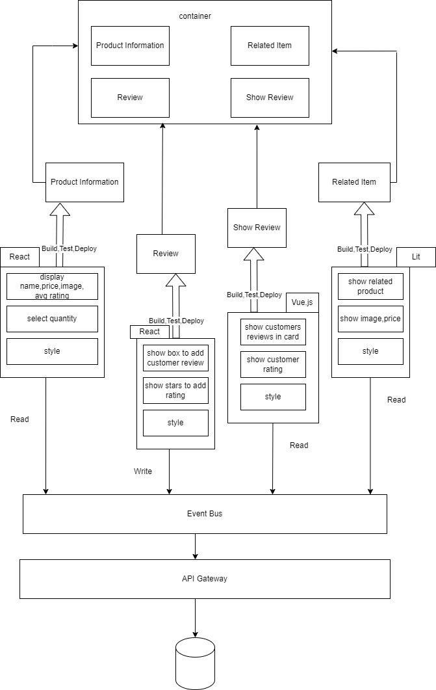
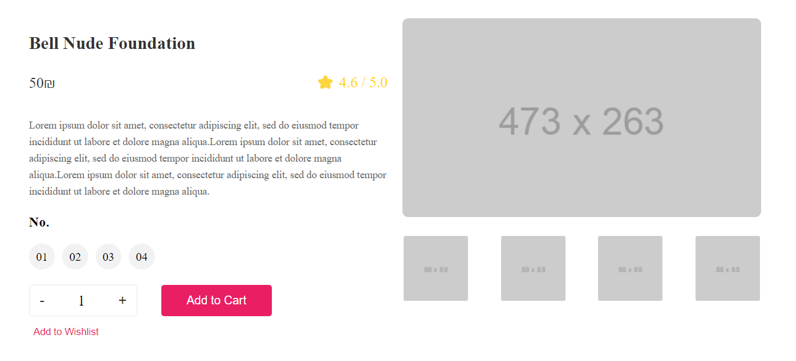
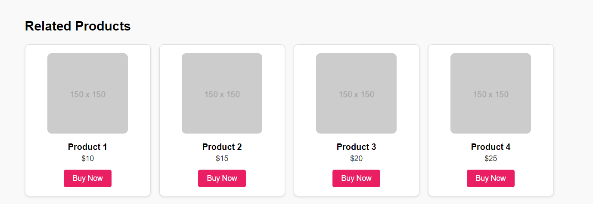
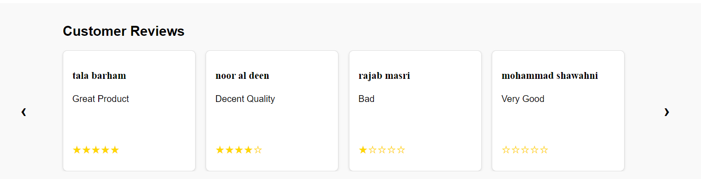
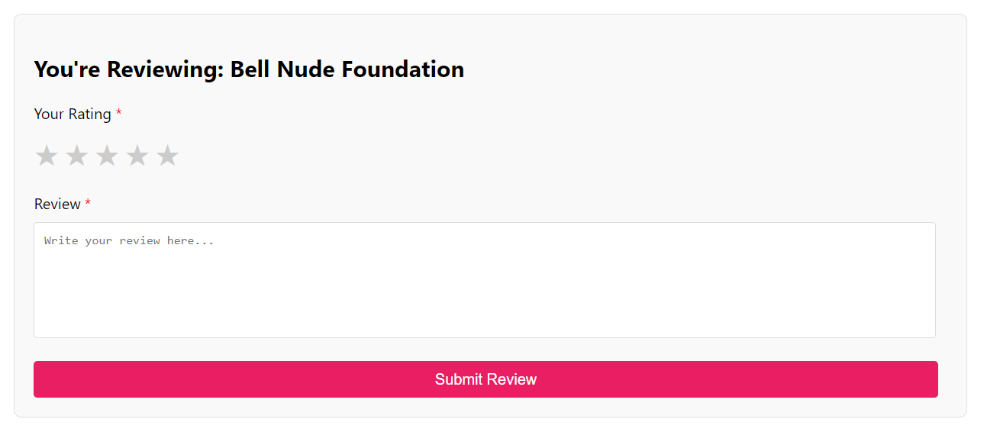

# Team3


# Project Overview

* Project Name : Mart.ps Improvement.
* Project Description : This project is a microfrontend-based web application that showcases a product page for Mart.ps. The page is divided into different sections, each developed using different frameworks to demonstrate the integration of React, Lit, and Vue.js within a single application.
## Project Goals:
* Demonstrate the use of a microfrontend architecture by integrating multiple frameworks.
* Provide a user-friendly interface for viewing product details, related products, and customer reviews.
* Enable users to add their reviews directly from the product page.

## Target Audience:
* Online shoppers looking for beauty products.
* Users who value customer reviews and recommendations in their decision-making process.

## Case Study: 
This project highlights how Mart.ps can leverage microfrontend architecture to scale its product offerings and improve user experience by integrating various technologies.


## Key Features:
* Product Information Section:
Displays the product name, price per unit, and an average customer rating.
Includes a brief product description highlighting the key features and benefits.
Users can select the quantity of the product they wish to purchase using a quantity selector.
Options to add the product to the shopping cart or wishlist are provided for easy purchasing or future reference.

* Related Products:
A carousel showcasing related products, complete with product images, names, and prices.
Each product includes a "Buy Now" button to encourage quick purchasing decisions.
* Customer Reviews:
A section dedicated to customer feedback, featuring a carousel of reviews.
Each review displays the customer's name, their feedback, and a star rating.
This section provides social proof and helps potential customers make informed decisions based on others' experiences.
* Review Submission Form:
Customers can leave their own reviews for the product by submitting a star rating and written feedback.
A user-friendly form allows for easy input and submission of reviews, fostering customer engagement and interaction.


# Project Architecture

## Micro Frontend Architecture
Single Bundle Strategy

Each section of the product page is treated as an independent microfrontend:
* Product Info: Developed using React.
* Related Products: Developed using Lit.
* Customer Reviews: Developed using Vue.js.
* Add Customer Review: Developed using React.

## Deployment Strategy & Integration Approach
Each microfrontend is deployed independently and integrated into the main application using Webpack's Single Bundle Strategy.

# Getting Started

## Prerequisites
* Node.js (v14.x or higher)
* npm (v6.x or higher)

## [1] Prodoct Info App 
### 1. Navigate to the Project Folder
Open a terminal and move to the project folder using the following command:
```bash
    cd .\CBSE-team3\product_component\e-commerce\
```
### 2. Install Dependencies
Install the required `node_modules` using the command:
```bash
    npm install
```
### 3. Run the Project
To run the project use the following command:
```bash
    npm run start
```
The project will run on a server at port 5173.

## [2] Related Items App 
### 1. Navigate to the Project Folder
Open a terminal and move to the project folder using the following command:
```bash
    cd .\CBSE-team3\related_items_component\related_items\
```
### 2. Install Dependencies
Install the required `node_modules` using the command:
```bash
    npm install
```
### 3. Run the Project
To run the project use the following command:
```bash
    npm run start
```
The project will run on a server at port 5173.

## [3] Show Review App 
### 1. Navigate to the Project Folder
Open a terminal and move to the project folder using the following command:
```bash
    cd \CBSE-team3\review_show_component\show-review
```
### 2. Install Dependencies
Install the required `node_modules` using the command:
```bash
    npm install
```
### 3. Run the Project
To run the project use the following command:
```bash
    npm run serve
```
The project will run on a server at port 8080.

## [4] Review App 
### 1. Navigate to the Project Folder
Open a terminal and move to the project folder using the following command:
```bash
    cd \CBSE-team3\review_component\review-component
```
### 2. Install Dependencies
Install the required `node_modules` using the command:
```bash
    npm install
```
### 3. Run the Project
To run the project use the following command:
```bash
    npm run start
```
The project will run on a server at port 3000.

## [5] Host App
### 1. Navigate to the Project Folder
Open a terminal and move to the project folder using the following command:
```bash
    cd .\team3\container\
```
### 2. Install Dependencies
Install the required `node_modules` using the command:
```bash
    npm install
```
### 3. Build the Project
To build the project use the following command:
```bash
    npm run build
```
### 4. Run the Project
To run the project use the following command:
```bash
    npm run start
```
The project will run on a server at port 9000.

## Micro Frontend Modules 









