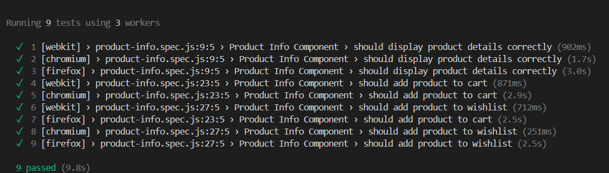

# Product Info Component

## Overview

The **Product Info Component** is a collection of React components designed to display detailed information about a product, including its name, price, rating, description, selection options, and images. This component is intended for e-commerce websites, where users can view product details, adjust quantity, and add items to their cart or wishlist.

## Goals
- **Primary Objectives**: 
  - To create a modular and extensible component that can be used across various e-commerce platforms.
  - To ensure a smooth user experience with quick and responsive data fetching and interaction handling.
  - To maintain compatibility across different browsers and devices.

- **Target Audience**: 
  - E-commerce website developers and teams looking for a pre-built solution to manage and display product details on their platforms.

## Features

- **Product Info Display**: Shows product name, price, rating, and description.
- **Image Section**: Displays the main product image and thumbnails.
- **Selection Control**: Allows users to select from different product options (e.g., size, color).
- **Quantity Selector**: Enables users to adjust the quantity of the product to add to the cart.
- **Add to Cart/Wishlist**: Provides buttons to add the product to the shopping cart or wishlist.
- **Data Fetching**: Dynamically fetches product data from a specified data source.

## Project Organization
The project is organized into several directories, each containing specific microfrontend modules and shared libraries:

- **components/**: Contains individual React components like ProductInfo, ImageSection, etc.
- **services/**: Handles data fetching and business logic.
- **assets/**: Includes stylesheets and other static assets.
- **tests/**: Contains Playwright test files.
- **data/**: Contains dummy data files that simulate API responses for development and testing purposes.


## Getting Started

### Prerequisites
- **Node.js** (v14+)
- **npm** (v6+)

### 1. Navigate to the Project Folder
Open a terminal and move to the project folder using the following command:

```bash
    cd .\product_component\e-commerce\
```

### 2. Install Dependencies
Install the required `node_modules` using the command:

```bash
    npm install
```

### 3. Run the Project

To run the project use the following command:

```bash
    npm run dev
```

The project will run on a server at port 5173.


## Usage

To use the **Product Info Component**, include it in your project and provide a valid data source URL for fetching product data.

```javascript
import ProductInfo from "./components/ProductInfo.jsx";

const App = () => {
    return (
        <div>
            <ProductInfo dataSource="https://api.example.com" />
        </div>
    );
};

export default App;
```

## Testing
To run the test use the following command:

```bash
    npx playwright test
```

this command run the test in three browsers [webkit, chromium, firefox]


This component is compatibility in different browser.


