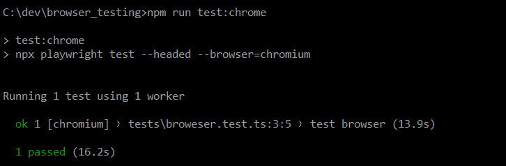
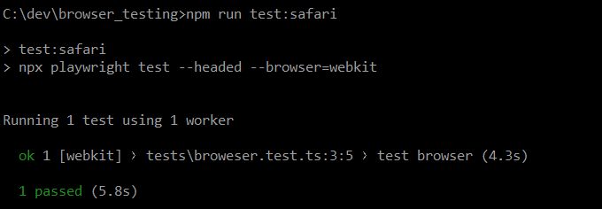
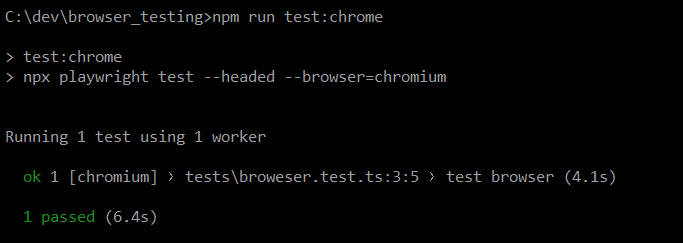
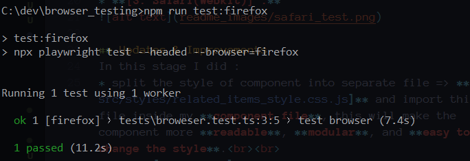
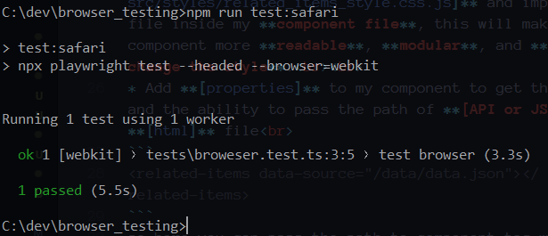

# Noor Al Deen Dwaikat Task 
## Initial Creating
**Description :** Develop a **[Related Items Component]** using **[Lit]**, 
so :<br>
 * **[1] :** I Installed the **[Lit Framework]**.
 * **[2] :** Import the **[JSON]** file that contains the data as a simulate for fetching data.
 * **[3] :** rendering **[html]** & **[css]** elements that the component lit required in **[/src/my-element.js]** then define the component tag.
 * **[4] :** Use the component tag in **[index.html]** file.

 ### Doing Test using [Lighthouse]

<br><br>
After doing test using **[lighthouse]** the results shown as at picture, the results are good but there somethings need to improves.

 ### Doing Test using [Playwright]
Doing this test to check the compatibility of component on browsers, I did this test on **[3]** browsers :
* **[1. Chrome] :** 
<br><br>

* **[2. Firefox] :** 
<br><br>

* **[3. Safari(Webkit)] :** 
<br><br>


## Updates & Improvements
In this stage I did : 
* split the style of component into separate file => **[/src/styles/related_items_style.css.js]** and import this file inside my **component file**, this will make the component more **readable**, **modular**, and **easy to change the style**.<br><br>
* Add **[properties]** to my component to get the data and the ability to pass the path of **[API or JSON]** in **[html]** file<br>
```
<related-items data-source="/data/data.json"></related-items>
```
so here you can pass the path to component tag with **[data-source]** attribute.<br><br>
* Add **[/src/utils/data-fetcher.js]** file to handle the logic of fetching data and to use this function inside my component.<br><br>
*  Use the function **[fetchData]** in **[firstUpdated]** lifecycle of lit to fetch the data.<br><br>
* Split the rendering into separate files => 
    * **[/components/product-card.js]** : make the card for product.<br><br>
    * **[/components/product-list.js]** : takes the products and create a card for each one using **[/components/product-card.js]**.<br><br>
   * **[/components/product-list.js]** : use in my component.  <br><br>

* This structure make the code more **maintainable** and **reusable**. This modular approach simplifies **updates and extensions**.

* **Flexible data fetching**

* Improved **Accessibility** by using semantic elements.

* Improved **SEO** by Adding meta descriptions.

* Improved **Performance** by utilizing the **loading="lazy"** attribute for images.
 ### Doing Test using [Lighthouse] #2


 ### Doing Test using [Playwright] #2

* **[1. Chrome] :** 
<br><br>

* **[2. Firefox] :** 
<br><br>

* **[3. Safari(Webkit)] :** 
<br><br>


## [src] folder structure
```
src/
  ├─ assets/
  │  └─ lit.svg
  ├─ components/
  │  ├─ product-card.js
  │  └─ product-list.js
  ├─ styles/
  │  └─ related_items_style.css.js
  ├─ utils/
  │  └─ data-fetcher.js
  ├─ index.css
  └─ my-element.js